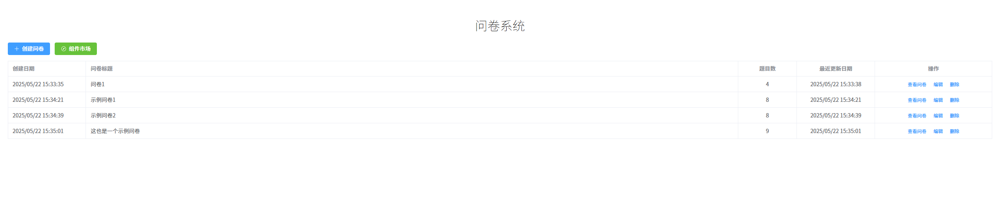

# 问卷调查系统

## 项目介绍

这是一个基于 Vue 3 + TypeScript + Vite 构建的现代化低代码问卷平台。该系统允许用户通过拖拽式设计器快速创建和管理问卷，支持多种题型和布局，并提供实时预览功能。所有数据通过 IndexedDB 存储在本地，无需后端服务器即可运行。

### 在线演示

[在线体验地址](#) (待部署)

## 项目截图

<div align="center">

### 系统首页



### 组件市场


### 创建问卷


### 问卷预览


### 在线问卷


</div>

## 技术栈

- **前端框架**：Vue 3 - 渐进式 JavaScript 框架
- **开发语言**：TypeScript - JavaScript 的超集
- **构建工具**：Vite - 下一代前端构建工具
- **UI 组件库**：Element Plus - 基于 Vue 3 的组件库
- **状态管理**：Pinia - Vue 的状态管理库
- **路由管理**：Vue Router - Vue.js 的官方路由
- **数据存储**：Dexie.js - IndexedDB 的包装器
- **样式处理**：SCSS - CSS 预处理器
- **拖拽功能**：vuedraggable - 基于 Sortable.js 的 Vue 拖拽组件
- **图标库**：Font Awesome - 强大的图标库

## 功能特性

- **问卷管理**：创建、编辑、删除和预览问卷
- **组件市场**：提供丰富的问卷组件，包括选择、文本输入、预设信息等多种自定义题型
- **低代码设计**：通过选择式设计利用组件市场快速创建问卷
- **拖拽设计**：通过拖拽方式调整题目顺序
- **在线预览**：编辑过程中实时预览问卷效果
- **本地存储**：使用 IndexedDB 进行数据本地存储
- **PDF生成**：将问卷转换为 PDF 格式
- **在线问卷**：生成在线问卷链接

## 开发环境要求

- Node.js = 18.18.2
- pnpm = 10.6.3

## 项目设置

### 安装依赖

```bash
pnpm install
```

### 开发环境运行

```bash
pnpm dev
```

### 生产环境构建

```bash
pnpm build
```

### 代码检查

```bash
pnpm lint
```

### 代码格式化

```bash
pnpm format
```

## 项目结构

```
├── src/                # 源代码目录
│   ├── assets/         # 静态资源文件
│   ├── components/     # 组件目录
│   │   ├── Common/     # 通用组件
│   │   ├── Editor/     # 编辑器相关组件
│   │   └── SurveyComs/ # 问卷组件
│   ├── composables/    # 组合式函数
│   ├── config/         # 配置文件
│   ├── db/             # 数据库相关
│   ├── router/         # 路由配置
│   ├── stores/         # 状态管理
│   ├── types/          # 类型定义
│   ├── utils/          # 工具函数
│   └── views/          # 页面视图
├── public/             # 静态资源
├── doc/                # 项目文档
├── .vscode/            # VSCode 配置
└── ...                 # 其他配置文件
```

## 许可证

[MIT](LICENSE)
